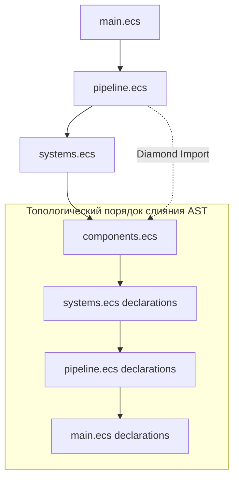
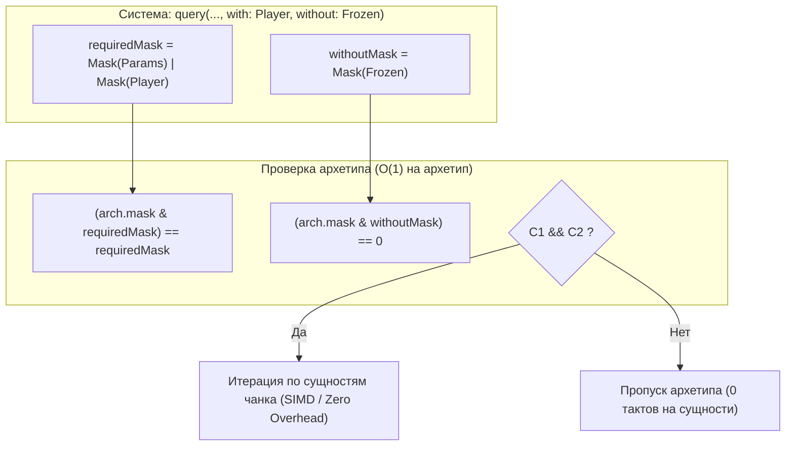
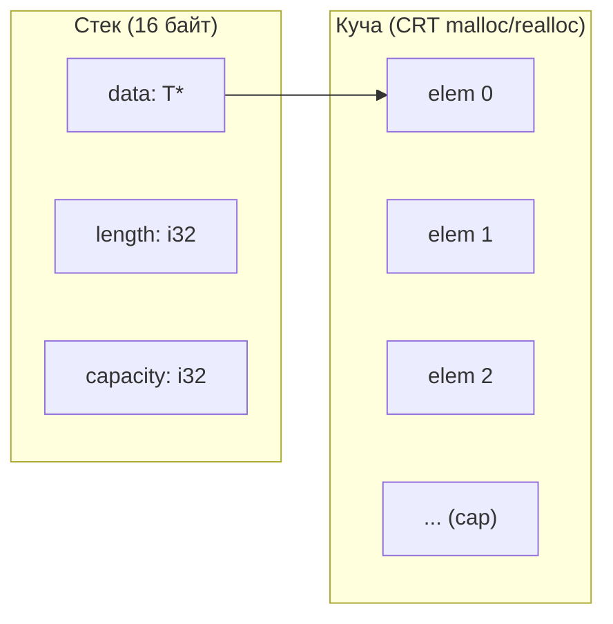
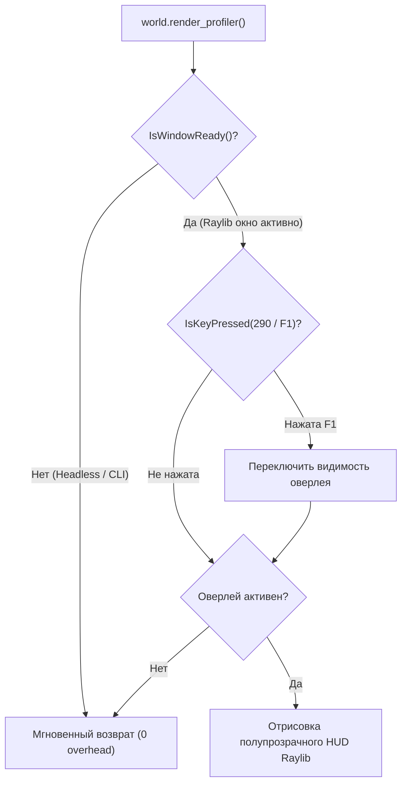
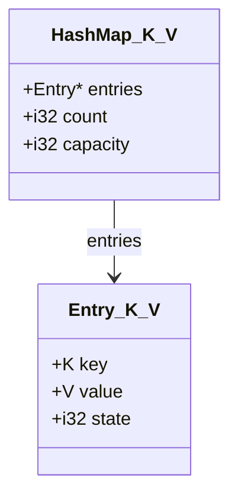
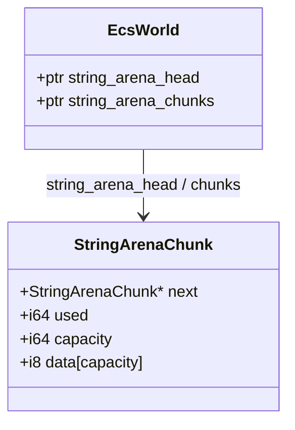
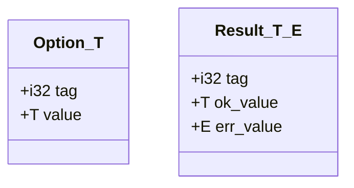
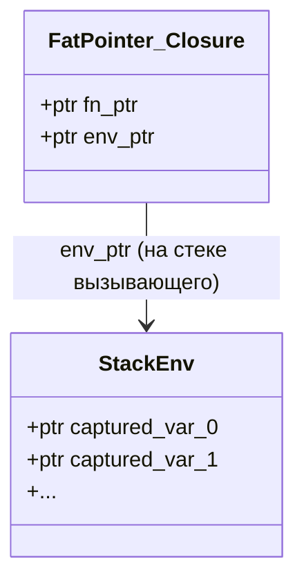

# Архитектура языка и компилятора ECSLang

Документ описывает внутреннее устройство, архитектурные решения и организацию подсистем языка программирования **ECSLang** и его компилятора. Документ поддерживается в актуальном состоянии по мере развития проекта.

---

## 1. Философия и цели языка

**ECSLang** — это компилируемый язык программирования общего назначения со встроенной первоклассной поддержкой парадигмы **Entity Component System (ECS)** и ориентированного на данные дизайна (**Data-Oriented Design, DOD**).

### Ключевые принципы:
1. **Изолированные контексты миров (Universal World Contexts)**:
   - В языке отсутствует глобальное скрытое состояние ECS. Мир (`World`) — это изолированная, переиспользуемая структура данных первого класса, создаваемая явно (`let mut world = ecs::create_world();`).
   - В одном процессе может одновременно существовать произвольное количество независимых миров (например, `game_world`, `ui_world`, `physics_world`).
2. **Нулевая стоимость абстракций (Zero-Cost ECS)**:
   - Доступ к полям компонентов внутри запросов систем разворачивается компилятором в прямые смещения указателей по непрерывным массивам памяти (SoA — Structure of Arrays).
   - Никаких динамических поисков в хэш-таблицах или виртуальных вызовов в горячих циклах итерации.
3. **Прямая компиляция в машинный код**:
   - Бэкенд компилятора генерирует **LLVM IR 20**, оптимизируется оптимизатором LLVM и компонуется нативным компоновщиком платформы (`link.exe` на Windows x64) в автономный бинарный файл `.exe`.

---

## 2. Структура проекта (Модули решения)

Решение `ECSLang.sln` построено на платформе **.NET 9 (C# 13)** и разделено на независимые проекты со строгим направлением зависимостей:

```
[ ECSLang.CLI ]
       │
       ▼
[ ECSLang.Toolchain ] ───► [ ECSLang.Codegen.LLVM ]
                                   │
                                   ▼
                         [ ECSLang.Semantics ]
                                   │
                                   ▼
                         [ ECSLang.Frontend ]
                                   │
                                   ▼
                           [ ECSLang.Core ]
```

### Назначение модулей:

| Проект | Пространство имен | Назначение |
|---|---|---|
| **`ECSLang.Core`** | `ECSLang.Core.*` | Базовые абстракции, модели токенов, узлы AST (`AstNodes.cs`), структуры диагностик ошибок и исходных интервалов (`SourceSpan`). |
| **`ECSLang.Frontend`** | `ECSLang.Frontend` | Лексический анализатор (`Lexer.cs`), модульный парсер рекурсивного спуска (`Parser.cs`, `Parser.Declarations.cs`, `Parser.Statements.cs`, `Parser.Expressions.cs`). Преобразует исходный текст `.ecs` в AST. |
| **`ECSLang.Semantics`** | `ECSLang.Semantics` | Таблицы символов (`SymbolTable`), система типов (`TypeSymbol`), модульная проверка семантики (`TypeChecker.cs`, `TypeChecker.Declarations.cs`, `TypeChecker.Statements.cs`, `TypeChecker.Expressions.cs`). |
| **`ECSLang.Codegen.LLVM`** | `ECSLang.Codegen.LLVM` | Модульный генератор LLVM IR (`LlvmCodeGenerator.cs`, `.Expressions.cs`, `.Statements.cs`, `.Ecs.cs`, `.Raylib.cs`) и эмиттер низкоуровневого рантайма SoA-архетипов (`EcsRuntimeEmitter.cs`, `.Archetypes.cs`, `.Profiler.cs`). Работает через `LLVMSharp 20.1.2`. |
| **`ECSLang.Toolchain`** | `ECSLang.Toolchain` | Интеграция с хост-инструментами: автопоиск MSVC `link.exe` и Windows SDK через `vswhere.exe`, генерация `.obj` и сборка финального `.exe`. |
| **`ECSLang.CLI`** | `ECSLang.CLI` | Точка входа командной строки: аргументы `build`, `run`, флаги `--emit-llvm`, `--emit-ir`, вывод диагностик компиляции. |

---

## 3. Фазы компиляции (Конвейер трансляции)

Компиляция исходного файла `.ecs` в исполняемый файл `.exe` проходит 5 строгих фаз:


### 1. Лексический анализ (`Lexer`)
- Преобразует поток символов UTF-8 в поток токенов (`Token`).
- Отслеживает точные номера строк и колонок (`SourceSpan`).
- Распознает составные операторы (`::`, `..`, `+=`, `-=`, `*=`, `/=`, `==`, `!=`, `<=`, `>=`), строковые литералы с экранированием, числа с плавающей точкой и целые числа.

### 2. Синтаксический анализ (`Parser`)
- Построен по принципу рекурсивного спуска (Recursive Descent Parser).
- Парсит декларации верхнего уровня:
  - `component Name { field: type, ... }`
  - `resource Name { field: type, ... }`
  - `struct Name { field: type, ... }`
  - `system Name { query(...) { ... } }`
  - `pipeline Name { stage Name { ... } }`
  - `fn Name(params): ReturnType { ... }`
- Парсит выражения методом Pratt / Precedence Climbing для учета приоритетов бинарных операторов.

### 3. Семантический анализ (`TypeChecker`)
- Двухпроходный анализ:
  - **Проход 1**: сбор сигнатур всех компонентов, ресурсов, структур, функций, систем и пайплайнов в глобальную область видимости.
  - **Проход 2**: проверка тел функций и систем, валидация типов выражений и областей видимости.
- Предотвращение конфликтов алиасинга в ECS: проверка, что две параллельные системы или два аргумента запроса не запрашивают мутабельный доступ к одному компоненту одновременно.
- Валидация методов экземпляров `World` (`spawn`, `set_*`, `add_*`, `remove_*`, `has_*`, `sort_hierarchy`).

### 4. Генерация LLVM IR (`LlvmCodeGenerator` & `EcsRuntimeEmitter`)
- Двухпроходная генерация функций (Pass 1 forward-declaration позволяет вызывать функции в любом порядке).
- Динамический синтез типов структур LLVM (`struct.Position`, `struct.res.Time`, `struct.user.Vector2`, `%struct.Archetype`, `%struct.EcsWorld`).
- Синтез низкоуровневых функций манипуляции сущностями и архетипами.
- Трансляция управляющих конструкций (`if`, `while`, `for`) в базовые блоки LLVM IR.
- Автоматический предохранитель закрытия консоли: автоматический вызов `@getchar()` перед возвратом из `main`, если не был вызван интерактивный ввод.

### 5. Линковка (`LinkerDriver`)
- Генерация объектного файла `.obj` под целевую тройку (`x86_64-pc-windows-msvc`).
- Автоматическое обнаружение установленного компилятора Visual Studio / Build Tools через `vswhere.exe`.
- Формирование вызова `link.exe` с подключением необходимых библиотек C-Runtime (`libcmt.lib`, `libucrt.lib`, `kernel32.lib`, `legacy_stdio_definitions.lib`).

---

## 4. Архитектура ECS Runtime (Машинный уровень)

Рантайм ECS компилируется непосредственно в машинный код модуля без внешних тяжелых зависимостей.

```
Структура мира (%struct.EcsWorld):
┌────────────────────────────────────────────────────────┐
│ next_entity_id: i32                                    │
│ entity_archetypes: ptr (массив id архетипа по entityId)│
│ entity_rows: ptr       (массив индекса строки в архетипе)│
│ archetypes_count: i32                                  │
│ archetypes_data: [16 x %struct.Archetype]              │
│ resources: встроенные структуры struct.res.*           │
└────────────────────────────────────────────────────────┘
```

### Структура Archetype (SoA — Structure of Arrays):
Каждый уникальный набор компонентов образует **Архетип** (`%struct.Archetype`):
- `mask: i64` — 64-битная сигнатура набора компонентов.
- `count: i32` — текущее количество сущностей в архетипе.
- `capacity: i32` — выделенная емкость массивов.
- `entities: ptr` — плотный массив `i32` идентификаторов сущностей.
- `columns: [N x ptr]` — массив указателей на непрерывные типизированные буферы данных компонентов.

### Динамическая миграция сущностей:
- При добавлении (`world.add_*`) или удалении (`world.remove_*`) компонента сущность мигрирует из текущего архетипа в целевой.
- Старая строка удаляется методом **Swap-Remove** (последняя сущность перемещается на место удаленной за $O(1)$ без сдвига массива).
- Существующие данные компонентов копируются в новый архетип, новое поле инициализируется переданными аргументами.

### Иерархия и топологическая сортировка:
- Встроенный компонент `ChildOf { parent: i32 }`.
- В стадиях пайплайна поддерживается нативная операция `sort_hierarchy;`.
- Функция `world_sort_hierarchy()` вычисляет глубины вложенности элементов и синхронно переставляет элементы во всех колонках архетипа, гарантируя, что родители всегда обрабатываются раньше потомков.

---

## 5. Графическая подсистема и интеграция Raylib (Window & 2D Graphics)

В язык встроена нативная поддержка создания окон, 2D-рендеринга и опроса устройств ввода на базе **Raylib 6.0** (C ABI):

- **Статическая линковка**: `raylib.lib` компонуется напрямую в результирующий `.exe` на этапе вызова `MsvcLinker`, что делает бинарный файл полностью автономным (без необходимости распространять `.dll`).
- **Широкая аппаратная совместимость (SSE2 / AVX)**: Библиотека скомпилирована под базовый набор инструкций x86_64 (SSE2), что гарантирует запуск на любых процессорах, включая поколения Intel Sandy Bridge (например, Core i5-2410M), не поддерживающие инструкции AVX2.
- **Автоматическая активация дискретной графики**: Компилятор и компоновщик автоматически экспортируют символы `NvOptimusEnablement = 1` и `AmdPowerXpressRequestHighPerformance = 1`. Это гарантирует, что на ноутбуках с гибридной графикой (Intel HD + NVIDIA GeForce / AMD Radeon) приложение сразу запускается на высокопроизводительном видеоадаптере с поддержкой полноценного OpenGL 3.3 Core profile.
- **Декларации в LLVM IR**: функции окна (`InitWindow`, `WindowShouldClose`, `CloseWindow`), отрисовки (`DrawRectangle`, `DrawCircle`, `DrawText`, `DrawLine`, `ClearBackground`) и ввода (`IsKeyDown`, `GetMouseX`, `GetMouseY`) объявлены с C-сигнатурами.
- **Представление цвета**: структура `Color { u8, u8, u8, u8 }` передается в x86_64 MSVC ABI как упакованное 32-битное число `i32` (`r | (g << 8) | (b << 16) | (a << 24)`), синтезируемое на лету в LLVM IR через сдвиги и побитовое ИЛИ.
- **Интеграция с типами ECS**: компилятор автоматически выполняет приведение вещественных координат (`f32`, используемых в физических компонентах) к целочисленным пиксельным координатам (`i32`), позволяя передавать поля `pos.x, pos.y` напрямую в `draw_circle` и `draw_rectangle`.

---

## 6. Подсистема событий и реактивности (Events & Observers)

В ECSLang реализована реактивная модель передачи сообщений и сигналов между системами без возникновения циклических зависимостей и блокировок:

```
                  ┌──────────────────────┐
                  │ world.emit(...)      │
                  └──────────┬───────────┘
                             │
                             ▼
┌────────────────────────────────────────────────────────┐
│ %struct.EcsWorld: Двойной буфер очереди событий        │
│ ┌───────────────────────────┐ ┌──────────────────────┐ │
│ │ Read Buffer (read_data)   │ │ Write Buffer         │ │
│ │ count: N, cap: C          │ │ count: M, cap: K     │ │
│ └─────────────┬─────────────┘ └──────────▲───────────┘ │
└───────────────┼──────────────────────────┼─────────────┘
                │                          │
                │        swap_events;      │
                │   (O(1) pointer swap)    │
                │ ◄────────────────────────┘
                ▼
  ┌───────────────────────────┐
  │ system { read(e: Event) } │
  └───────────────────────────┘
```

### 1. Двойная буферизация событий (Double-Buffered Event Queues):
- Для каждого объявленного типа `event Name { ... }` в структуру `%struct.EcsWorld` встраиваются 6 полей:
  `i32 read_count`, `i32 read_cap`, `ptr read_data`, `i32 write_count`, `i32 write_cap`, `ptr write_data`.
- Системы, выполняющиеся на текущем тике или в текущей фазе конвейера, записывают события в `write_data` через динамически растущий буфер (`@world_emit_{Name}`).
- Системы-наблюдатели (`read(...)`) читают исключительно неизменяемый `read_data`. Это исключает гонки данных и изменение коллекций во время их итерации.

### 2. Нулевая стоимость смены буферов (Zero-Copy O(1) Buffer Swap):
- Функция `@world_swap_events(ptr %world)` сбрасывает `write_count = 0`, устанавливает `read_count = old_write_count` и мгновенно меняет местами указатели `read_data` и `write_data`, а также их емкости `read_cap` и `write_cap`.
- Смена буферов выполняется:
  - Автоматически в начале каждого вызова конвейера (`pipeline`), если конвейер не содержит явных действий `swap_events;`.
  - Явно на границе стадий пайплайна с помощью инструкции `swap_events;` (например, между стадией физики `Physics` и стадией реакции `Reaction`).
  - Программно из пользовательского кода через `world.swap_events()`.

### 3. Системы-наблюдатели (Observer Systems):
- Системы с декларацией `read(param: EventName, ...)` не обходят архетипы и таблицы сущностей.
- Компилятор генерирует плоский цикл по `0..read_count`, считывая экземпляры событий напрямую из типизированного непрерывного буфера `read_data`.
- Системы-наблюдатели могут одновременно запрашивать доступ к глобальным ресурсам: `read(col: Collision, mut stats: GameStats)`.

---

## 7. Многопоточность, DAG-анализ и Job System (Multithreading & Concurrency)

ECSLang включает встроенную высокопроизводительную многопоточную модель выполнения систем с автоматическим контролем гонок данных (Data-Race Free Concurrency):

```
┌────────────────────────────────────────────────────────┐
│ Статический DAG-анализ зависимостей (TypeChecker)      │
│  - SystemA: query(mut Position, Velocity)              │
│  - SystemB: query(mut Shield)                          │
│  - SystemC: query(mut Health)                          │
│  Результат: Непересекающиеся множества записи/чтения  │
│             Разрешено параллельное исполнение!         │
└──────────────────────────┬─────────────────────────────┘
                           │
                           ▼
┌────────────────────────────────────────────────────────┐
│ Нативный Windows ThreadPool (kernel32.dll)             │
│  ┌─────────────────┐ ┌─────────────────┐ ┌───────────┐ │
│  │ Worker Thread 1 │ │ Worker Thread 2 │ │ Worker... │ │
│  │ job_SystemA     │ │ job_SystemB     │ │ SystemC   │ │
│  └────────┬────────┘ └────────┬────────┘ └─────┬─────┘ │
└───────────┼───────────────────┼────────────────┼───────┘
            │                   │                │
            ▼                   ▼                ▼
┌────────────────────────────────────────────────────────┐
│ Базовый барьер синхронизации (WaitForThreadpoolWork)   │
│ Все воркеры завершены -> переход к следующему шагу     │
└────────────────────────────────────────────────────────┘
```

### 1. Статический DAG-анализ зависимостей и предотвращение Data Race:
- Компилятор автоматически строит множества доступа для каждой системы:
  - `MutComponents` / `ConstComponents` — изменяемые и неизменяемые компоненты.
  - `MutResources` / `ConstResources` — изменяемые и неизменяемые ресурсы.
- Для любых систем, объединенных в блок `parallel { SystemA; SystemB; }`, семантический анализатор строго проверяет условия гонки данных:
  - Никакая система не может писать (`mut`) в компонент или ресурс, который читает или пишет другая система в этом же параллельном блоке.
  - При наличии конфликта компилятор не генерирует код и выдает точную ошибку с указанием конфликтующих систем, ресурса и типа конфликта (write-read, write-write, read-write).
  - Системы, только читающие одинаковые компоненты (`const`), могут выполняться параллельно в неограниченном количестве потоков без накладных расходов.

### 2. Нативный пул потоков (Win32 ThreadPool API):
- Компилятор напрямую подключает функции системного пула потоков Windows (`kernel32.lib`):
  `CreateThreadpoolWork`, `SubmitThreadpoolWork`, `WaitForThreadpoolWorkCallbacks`, `CloseThreadpoolWork`.
- Для каждой системы генерируется легковесная обертка функции обратного вызова `job_{Name}` с сигнатурой `PTP_WORK_CALLBACK`.
- При вызове параллельного блока конвейера задачи мгновенно диспатчатся в пул потоков операционной системы.
- Ожидание завершения задач реализуется через нативный барьер ожидания без спинлоков и без потерь процессорного времени.

---

## 8. Расширенные структуры данных (Advanced Data Structures)

### 1. Массивы фиксированного размера `[T; N]`:
- **Синтаксис типа**: `[T; N]`, где `T` — тип элементов, `N` — константный положительный размер. Поддерживается в полях компонентов, ресурсов, структур, сигнатурах функций и локальных переменных.
- **Машинное представление**: отображается напрямую в нативный агрегатный тип LLVM `[N x T]`.
- **Индексация и доступ к памяти**:
  - Чтение: `arr[i]` или `comp.items[i]` генерирует `InBoundsGEP2(arrType, basePtr, [0, i])` и одиночный `BuildLoad2` скалярного типа элемента.
  - Модификация: `arr[i] = val;` или `arr[i] += val;` вычисляет смещение элемента через GEP и выполняет прямую запись в память без промежуточного копирования всего массива.
- **Интеграция с SoA**: при размещении массива в компоненте (`component Inventory { items: [i32; 4] }`), колонка архетипа хранит непрерывный массив структур/массивов, что гарантирует максимальную локальность кэша процессора при векторных итерациях.

### 2. Перечисления `enum` и сопоставление с образцом `match`:
- **Декларация `enum`**:
  - `enum Name { Member1, Member2 = 10, Member3 }`.
  - Члены перечисления получают последовательные дискриминанты (начиная с 0 или от явно заданного целочисленного значения).
  - На уровне системы типов и машинного кода LLVM `enum` отображается в 32-битное целое число (`i32`), что позволяет использовать его без накладных расходов в регистрах, стеке и столбцах архетипов.
- **Оператор `match`**:
  - Синтаксис:
    ```rust
    match expr {
        Pattern1 => { ... }
        Pattern2 => { ... }
        _ => { ... } // Ветка по умолчанию (wildcard)
    }
    ```
  - **Машинная генерация**:
    - Компилятор компилирует конструкцию `match` в нативную инструкцию `BuildSwitch` LLVM с набором константных меток перехода.
    - LLVM автоматически оптимизирует такой `switch` в прямую таблицу переходов (jump table) либо двоичный поиск с логарифмической сложностью $O(\log k)$ в зависимости от плотности значений дискриминантов.
    - Ветка `_` (wildcard) сопоставляется с базовым блоком `defaultBB`.

---

## 9. Отложенные команды мутации мира (Command Buffer & Deferred Mutations)

В ECS-архитектуре непосредственная модификация мира (спавн сущностей, удаление сущностей, добавление или удаление компонентов) внутри циклов итерации систем приводит к инвалидации итераторов (*iterator invalidation*), порче кэша строк архетипов и гонкам данных в многопоточном режиме. Для решения этой проблемы в ECSLang реализован высокопроизводительный **Command Buffer**.

### 1. Представление в памяти `%struct.EcsWorld`:
К структуре мира добавлены поля буфера команд:
- **`cmd_count` (`i32`)**: текущий объем записанных байт команд.
- **`cmd_cap` (`i32`)**: выделенная емкость байтового буфера (динамический реаллок с шагом удвоения, начальный минимум 1024 байта).
- **`cmd_data` (`ptr i8`)**: указатель на непрерывный байтовый поток команд.
- **`cmd_lock` (`ptr i8` / `SRWLOCK`)**: нативный 64-битный примитив синхронизации Windows Slim Reader/Writer Lock (`kernel32.lib`), инициализируемый нулями (`SRWLOCK_INIT`).

### 2. Формат бинарного потока команд:
Каждая команда записывается в плотный поток без дополнительных аллокаций в куче:
1. **`CMD_SPAWN` (`op = 1`)**:
   - Формат: `[i32 op (1), i32 entity_id]` (8 байт).
   - Вызов `cmd.spawn()` мгновенно резервирует уникальный идентификатор сущности через `world_alloc_entity`, записывает команду спавна в буфер и возвращает `Entity` (`i32`). Это позволяет связывать компоненты с новой сущностью в том же тике до фактического создания архетипа.
2. **`CMD_DESPAWN` (`op = 2`)**:
   - Формат: `[i32 op (2), i32 entity_id]` (8 байт).
   - Вызов `cmd.despawn(entity)` ставит сущность в очередь на гарантированное уничтожение.
3. **`CMD_SET` (`op = 3`)**:
   - Формат: `[i32 op (3), i32 entity_id, i32 comp_id, payload_bytes...]` ($12 + \text{sizeof}(Comp)$ байт).
   - Поддерживает синтаксис `cmd.set_Comp(e, fields...)`, `cmd.add_Comp(e, fields...)`, `cmd.set(e, Comp(...))` и `cmd.add(e, Comp(...))`.
   - Поля компонента сериализуются прямо в поток с соблюдением выравнивания типов LLVM.
4. **`CMD_REMOVE` (`op = 4`)**:
   - Формат: `[i32 op (4), i32 entity_id, i32 comp_id]` (12 байт).
   - Помечает компонент для удаления из сущности и последующей миграции в архетип с меньшей маской.

### 3. Алгоритм $O(1)$ Despawn (Archetype Swap-Remove):
Функция `world_despawn(world, entity)` выполняет удаление сущности за константное время:
1. Проверяет валидность и статус жизни сущности (`world.entity_arch[e] >= 0`). Если сущность уже уничтожена — немедленный возврат.
2. Получает текущий архетип `curArch = world.arch_tables[curArchIdx]` и строку `curRow = world.entity_row[e]`.
3. Уменьшает счетчик `lastRow = curArch.count - 1; curArch.count = lastRow;`.
4. Если `curRow != lastRow` (удаляемая сущность не последняя в таблице):
   - Идентификатор последней сущности `movedE = curArch.entities[lastRow]` перемещается в `curArch.entities[curRow]`.
   - Для всех активных колонок компонентов в битовой маске архетипа данные копируются из строки `lastRow` в строку `curRow` через `llvm.memcpy`.
   - Обновляется индекс строки перенесенной сущности: `world.entity_row[movedE] = curRow`.
5. Исходная сущность помечается как мертвая: `world.entity_arch[e] = -1`, `world.entity_row[e] = -1`.

### 4. Потокобезопасность в параллельных конвейерах:
- Добавление команд в буфер защищено эксклюзивным захватом `AcquireSRWLockExclusive` / `ReleaseSRWLockExclusive`.
- Благодаря этому несколько систем, выполняющихся параллельно в блоке `parallel { SystemA; SystemB; }`, могут одновременно спавнить и удалять сущности без риска гонок данных и повреждения памяти.

### 5. Пакетное применение команд (`world_apply_commands`):
- Функция `world_apply_commands(world)` последовательно разбирает поток команд и применяет их к миру вне итерационных циклов систем.
- Вызывается:
  - Явно через ключевое слово `apply_commands;` в описании стадий конвейера.
  - Автоматически на барьерах синхронизации между стадиями конвейера.
  - Из пользовательского кода через `world.apply_commands()`.
- По завершении счетчик `world.cmd_count` сбрасывается в 0, а выделенная память буфера повторно используется в следующих кадрах симуляции без фрагментации кучи.

---

## 10. Оптимизации LLVM и отладка (LLVM Pass Manager & Debug Info)

ECSLang интегрирован с современным менеджером оптимизаций LLVM (New Pass Manager) и генератором отладочной информации (DIBuilder):

```
┌─────────────────────────────────────────────────────────────────┐
│ Сгенерированный AST / Неоптимизированный LLVM IR                 │
└───────────────────────────────┬─────────────────────────────────┘
                                │
        ┌───────────────────────┴────────────────────────┐
        ▼                                                ▼
┌───────────────────────────────┐        ┌───────────────────────────────┐
│ Debug Mode (-O0, -g)          │        │ Release Mode (--release, -O3) │
│ - CodeView метаданные         │        │ - Loop Vectorization (SIMD)   │
│ - Привязка DILocation (строки)│        │ - SLP Vectorization           │
│ - Генерация PDB файла MSVC    │        │ - Loop Unroll & InstCombine   │
│ - Пошаговая отладка в VS      │        │ - Function Inlining & DCE     │
│                               │        │ - Linker /OPT:REF /OPT:ICF    │
└───────────────┬───────────────┘        └───────────────┬───────────────┘
                │                                        │
                ▼                                        ▼
    multi_archetype.pdb                      Ускорение вычислений 3.0x+
    (пошаговый дебаг в IDE)                  (2 ms/frame на 100k частиц)
```

### 1. Архитектура New Pass Manager (`LLVMRunPasses`):
- Компилятор использует современный PassBuilder API LLVM (`LLVMPassBuilderOptionsRef`, `LLVMRunPasses`).
- Поддерживаются пайплайны оптимизации:
  - `-O0`: `default<O0>` — базовая генерация кода без изменения графа инструкций.
  - `-O1`: `default<O1>` — простые локальные оптимизации.
  - `-O2`: `default<O2>` — стандартный оптимизирующий пайплайн LLVM.
  - `-O3`: `default<O3>` — агрессивные межпроцедурные оптимизации, векторизация и инлайнинг.
  - `-Os`, `-Oz`: `default<Os>`, `default<Oz>` — оптимизация по размеру исполняемого файла.
- В релизных сборках активируются специализированные флаги:
  - `PassBuilderOptionsSetLoopVectorization(1)` — векторизация плотных итераций по непрерывным массивам компонентов в SoA-архетипах (AVX2 / SSE4).
  - `PassBuilderOptionsSetSLPVectorization(1)` — суперсловная векторизация прямых вычислений внутри выражений систем.
  - `PassBuilderOptionsSetLoopUnrolling(1)` — разворачивание коротких циклов для устранения ветвлений.
  - `PassBuilderOptionsSetMergeFunctions(1)` — объединение одинаковых функций.

### 2. Генерация отладочной информации (`DIBuilder`):
- При указании флагов `-g` или `--debug` компилятор подключает `DIBuilder`:
  - В модуль добавляются флаги CodeView (`module.AddModuleFlag("CodeView", ..., 1)`) и версия метаданных (`"Debug Info Version", ..., 3`).
  - Создаются `DICompileUnit` и `DIFile` с привязкой к реальному пути исходного `.ecs` файла.
  - Для каждой функции, системы и конвейера создается дескриптор `DISubprogram`.
  - Каждая инструкция и выражение связываются с точными номерами строк и колонок (`SourceSpan`) через `DILocation`.
  - На этапе линковки MSVC Linker генерирует сопутствующий `.pdb` файл (`/DEBUG /PDB:"output.pdb"`), обеспечивая полноценную пошаговую отладку в Visual Studio, Visual Studio Code и WinDbg.

### 3. Производительность (Debug vs Release Benchmark):
На бенчмарке [`examples/optimization_benchmark.ecs`](file:///C:/Users/office/Documents/ECS_Lang/examples/optimization_benchmark.ecs) (симуляция 100 000 частиц с 3 компонентами `Position`, `Velocity`, `Particle`, гравитацией, затуханием и проверкой коллизий границ):
- **Debug (`-O0`)**: 140 ms на 20 кадров (~7.0 ms на кадр).
- **Release (`-O3`)**: 47 ms на 20 кадров (~2.3 ms на кадр).
- **Итоговое ускорение**: **3.0x** прирост чистой вычислительной производительности при полном сохранении корректности физики.

---

## 11. Модульная система и многофайловые проекты (`import` / `ProjectLoader`)

Для структурирования масштабных проектов компилятор ECS-Lang поддерживает разделение исходного кода на независимые модули с директивой `import`.

### 1. Синтаксис импорта
- **По относительному пути**: `import "path/to/module.ecs";`
- **По идентификатору**: `import components;` (автоматически транслируется в поиск файла `components.ecs` в директории текущего файла).

### 2. Загрузка проектов (`ProjectLoader`)
Класс [`ProjectLoader`](file:///C:/Users/office/Documents/ECS_Lang/src/ECSLang.Frontend/ProjectLoader.cs) выполняет оркестрацию загрузки всех модулей проекта перед запуском семантического анализатора:



### 3. Разрешение зависимостей и гарантии
1. **Нормализация путей**: все импорты разрешаются относительно директории импортирующего файла с приведением к абсолютному каноническому пути (`Path.GetFullPath`). Сравнение путей нечувствительно к регистру (`OrdinalIgnoreCase`).
2. **Топологический post-order обход**: зависимости файла обходятся рекурсивно до добавления его собственных деклараций в результирующее синтаксическое дерево. В сгенерированном AST компоненты и структуры всегда объявлены до систем и конвейеров, которые их используют.
3. **Обнаружение циклов (Cycle Detection)**:
   - Стек обхода `_inProgressStack` отслеживает цепочку загрузки.
   - При обнаружении повторного входа формируется точная диагностическая ошибка с указанием пути цикла:
     `Circular dependency detected: cycle_a.ecs -> cycle_b.ecs -> cycle_a.ecs`.
4. **Устранение дубликатов (Diamond Dependency)**:
   - Если один и тот же модуль импортируется несколькими независимыми файлами (например, `components.ecs` нужен и в `systems.ecs`, и в `pipeline.ecs`), он парсится и включается в результирующее дерево строго один раз.

---

## 12. Подсистема строковых операций, интерполяции и CRT-хелперов

### 1. Десугаризация интерполяции строк (AST Desugaring)
Для минимизации сложности промежуточных представлений и максимального переиспользования LLVM-оптимизаций интерполированные строки (`$"..."` и `f"..."`) десугаризируются непосредственно в парсере:

```mermaid
flowchart LR
    Token["$"Player: {name}, Score: {score}""] --> Parser["Parser.ParseInterpolatedString"]
    Parser --> AST["BinaryExpression(+)
    ├── BinaryExpression(+)
    │   ├── "Player: "
    │   └── CallExpression(to_string, name)
    └── BinaryExpression(+)
        ├── ", Score: "
        └── CallExpression(to_string, score)"]
```

Каждое подвыражение внутри фигурных скобок `{...}` изолированно токенизируется и парсится как валидное выражение языка, после чего автоматически оборачивается в вызов `to_string(...)`.

### 2. Runtime-хелперы для генерации кода строк
Для обеспечения высокой производительности и отсутствия тяжелых внешних зависимостей компилятор генерирует легковесные служебные функции с компоновкой по требованию (on-demand generation):

- `rt_str_concat(s1: ptr, s2: ptr) -> ptr`:
  - Вычисляет `strlen(s1)` и `strlen(s2)`.
  - Выделяет память через CRT `malloc(len1 + len2 + 1)`.
  - Копирует блоки через CRT `memcpy`.
  - Записывает терминирующий нулевой байт `\0`.
- `rt_to_string_i32(val: i32) -> ptr`:
  - Выделяет буфер из 32 байт и форматирует число через CRT `sprintf(buf, "%d", val)`.
- `rt_to_string_f32(val: f32) -> ptr`:
  - Расширяет `float` до `double` и форматирует через CRT `sprintf(buf, "%.2f", val)`.
- `rt_to_string_bool(val: i1) -> ptr`:
  - Возвращает указатель на глобальную константную строку `"true"` или `"false"` без аллокаций памяти (`llvm.select`).
- `rt_str_eq(s1: ptr, s2: ptr) -> i1`:
  - Вызывает CRT `strcmp(s1, s2)` и проверяет результат на равенство 0.

### 3. Стандартная математическая библиотека
Все встроенные математические функции преобразуются либо в нативные инструкции процессора, либо в оптимизированные CRT-вызовы:
- `abs(x)`: для `float` компилируется в `fneg` + `fcmp olt 0.0` + `select` (LLVM преобразует в битовую маску `andps`), для `i32` — в `neg` + `icmp slt 0` + `select`.
- `min(a, b)`, `max(a, b)`: компилируются в `icmp`/`fcmp` + `select` (аппаратные инструкции `cmov` / `minss` / `maxss`).
- `clamp(v, min, max)`: двухуровневый `select` без вызовов подпрограмм.
- `sqrt`, `sin`, `cos`, `floor`, `ceil`: вызовы нативных C ABI функций `sqrtf`, `sinf`, `cosf`, `floorf`, `ceilf`.
- `rand_range(min, max)`: масштабирование вызова `rand()` через `min + (rand() % (max - min + 1))`.

---

## 13. Предикаты и фильтрация архетипов (`with` и `without`)

### 1. Архитектура битовых масок запроса
При обходе конвейера систем выбор подходящих архетипов выполняется компилятором заранее через битовые маски 64-битных целых чисел (`i64`):



### 2. Гарантии производительности
1. **Zero-overhead loop bodies**: во внутреннем цикле системы по сущностям (`while row < arch.count`) не выполняется ни одной проверки условий `with` или `without`. Если архетип содержит запрещенный компонент или не содержит маркер, он отсекается целиком на уровне таблицы архетипа.
2. **Маркерные компоненты (Zero Allocation)**: фильтр `with: Marker` гарантирует наличие компонента без выделения стековой памяти и без загрузки колонок данных, что идеально подходит для тегов состояний (`Player`, `Enemy`, `Selected`, `Grounded`).

---

## 14. Мультимедиа, Текстуры, Аудио и 2D Камера (Raylib C ABI)

### 1. Архитектура маршалинга C ABI под MSVC x64
Библиотека Raylib использует структуры C (`Texture2D`, `Camera2D`, `Sound`, `Rectangle`, `Vector2`). Согласно соглашению вызова Microsoft x64 Calling Convention:
- Агрегаты размером 1, 2, 4 или 8 байт передаются в регистрах общего назначения (или в стековых слотах) по значению.
- Агрегаты размером > 8 байт передаются **по ссылке** (указатель на память, подготовленную вызывающей стороной).
- Функции, возвращающие структуры размером > 8 байт (например, `LoadTexture`, `LoadSound`), используют скрытый первый параметр (`sret`), куда передается адрес буфера для записи возвращаемого значения.

### 2. Управление дескрипторами и памятью
1. **Opaque Handles (`i64`)**:
   - При вызове `load_texture(path)` компилятор выделяет буфер через системный CRT `malloc` и передает его в `LoadTexture` первым аргументом (`sret`). Возвращаемый указатель конвертируется в 64-битный дескриптор `i64`.
   - При вызове `unload_texture(tex)` компилятор вызывает нативную процедуру Raylib `UnloadTexture` (освобождающую VRAM GPU), после чего немедленно освобождает дескриптор из кучи через CRT `free`.
   - Аналогичная схема применяется для аудиодескрипторов `load_sound(path)` и `unload_sound(snd)`.
2. **2D Камера (`BeginMode2D`)**:
   - Матрица камеры `Camera2D` (24 байта: `offset: Vec2`, `target: Vec2`, `rotation: f32`, `zoom: f32`) размещается в стековом кадре вызывающей функции через `alloca`.
   - В вызов `BeginMode2D` передается прямой стековый указатель, что исключает накладные расходы на динамическую память (`Zero Heap Allocation`).
3. **Спрайты (`DrawTexturePro`)**:
   - Прямоугольники `Rectangle source` и `Rectangle dest` (по 16 байт) размещаются в стеке и передаются указателями.
   - `Vector2 origin` (8 байт) передается по значению как единое 64-битное целое число (`i64`) в регистре `R9`.

---

## 15. Методы пользовательских структур и компонентов (`impl Struct`)

### 1. Архитектура методов и соглашение вызова (`thiscall` / C ABI)
- Методы, объявленные в блоках `impl StructName { ... }`, компилируются в нативные функции с префиксом типа: `@StructName_MethodName`.
- Статические (ассоциированные) функции не имеют параметра `self` и вызываются через оператор пути: `StructName::function(args)`.
- Методы экземпляра принимают первым неявным аргументом указатель на структуру (`Struct* self`):
  - При вызове `val.method(args)` компилятор передает прямой стековый указатель на локальную переменную (`alloca`) или GEP-указатель на поле структуры / компонент сущности.
  - Это обеспечивает **Zero Allocation** и **Zero Copy** — большие структуры не копируются на стек при вызовах методов.

### 2. Мутирующие методы (`mut self`) и прямая мутация в ECS
- Параметр `mut self` указывает компилятору, что метод может изменять поля целевой структуры in-place.
- В системах ECS (`query(mut pos: Position)`) вызов `pos.translate(dx, dy)` выполняется напрямую по указателю на соответствующий слот в памяти чанка архетипа без промежуточных присваиваний или копирований.

---

## 16. Динамические массивы (`Vec<T>` / `List<T>` / `[T]`)

### 1. Представление в LLVM IR (Memory Layout)
Динамический массив представляется как компактная структура из 3 полей (16 байт на x64 ABI):
```llvm
%Vec_T = type { %T*, i32, i32 }
; поле 0: data     (указатель на непрерывный буфер элементов)
; поле 1: length   (текущее количество активных элементов)
; поле 2: capacity (выделенная вместимость буфера)
```



### 2. Экспоненциальный рост и CRT Realloc
- При операции `.push(item)` проверяется условие `length >= capacity`.
- Если буфер заполнен (`is_full`), вычисляется новая емкость:
  $$\text{capacity}_{new} = \begin{cases} 4, & \text{если } \text{capacity} = 0 \\ \text{capacity} \times 2, & \text{иначе} \end{cases}$$
- Выделение и перемещение памяти выполняется стандартной функцией CRT `realloc(data, new_capacity * sizeof(T))`, что позволяет менеджеру кучи расширять блок на месте (in-place) без лишних копирований, если за ним есть свободное адресное пространство.
- Элемент записывается в слот `data[length]`, после чего `length` инкрементируется.

### 3. Десугаризация `for-in` цикла
Синтаксическая конструкция `for item in collection { ... }` десугаризируется в парсере в эффективный индексированный цикл:
```rust
for __idx_item in 0..collection.len() {
    let item = collection[__idx_item];
    // тело цикла
}
```
Это полностью исключает накладные расходы на создание объектов-итераторов и аллокации.

---

## 17. Встроенный визуальный ECS-профайлер и инспектор (F1)

Встроенный профайлер реализован в генераторе рантайма (`EcsRuntimeEmitter.cs` -> `world_render_profiler(ptr world)`) и предоставляет zero-overhead мониторинг состояния мира и кадровой частоты.

### 1. Zero-Cost Headless Guard
Функция первым делом вызывает `IsWindowReady()`. Если приложение выполняется в консольном режиме или окно Raylib закрыто/не создано, генератор немедленно выполняет `ret void`. Это гарантирует абсолютную безопасность вызова `world.render_profiler()` в любых типах приложений (серверы, консольные утилиты, тесты).



### 2. Структура HUD-оверлея
- **Подложка**: `DrawRectangle` с полупрозрачным фоном RGBA (0x1E140F, Alpha=235) и неоновой акцентной рамкой `DrawRectangleLines`.
- **Заголовок**: Текущая версия рантайма ECSLang (`ECSLang Engine v0.24 - ECS Profiler & Inspector`).
- **Счетчик кадров**: Значение FPS зеленым цветом (`GetFPS()`) и время кадра в миллисекундах (`GetFrameTime() * 1000.0`).
- **Инспектор сущностей и архетипов**:
  - Чтение поля `entity_count` из структуры `World`.
  - Динамический обход массива архетипов мира (`arch_array`).
  - Для каждого зарегистрированного архетипа выводятся: его порядковый номер, битовая маска компонентов (`mask: 0x...`), количество сущностей в первом чанке и емкость чанка (`count: N/capacity`).

---

## 18. Хэш-таблицы (`HashMap<K, V>`) и именованная индексация сущностей

Хэш-таблицы в ECSLang спроектированы в соответствии с DOD-принципами: непрерывное размещение слотов в памяти (Flat Array), открытая адресация (Open Addressing) и линейное пробирование (Linear Probing) для обеспечения максимальной локальности кэша процессора.

### 1. Низкоуровневая структура памяти

Каждая инстанциация карты состоит из дескриптора и массива слотов (`Entry`):



Слот `Entry` содержит поле `state`:
- `0` (`Empty`): слот свободен, поиск по цепочке завершается.
- `1` (`Occupied`): слот занят активной парой ключ-значение.
- `2` (`Tombstone`): элемент удален, цепочка пробирования не прерывается.

### 2. Хэширование и поиск

- **Строки (`string` / `i8*`)**: 32-битный алгоритм **FNV-1a** (смещение `2166136261`, множитель `16777619`).
- **Целые числа и сущности (`i32`, `i64`, `entity`)**: мультипликативный хэш Кнута (**Knuth Multiplicative Hashing**, золотое сечение `2654435761`).
- **Вещественные числа (`f32`, `f64`)**: побитовое приведение к целому (`bitcast`) с последующим хэшированием Кнута.
- **Емкость таблицы**: всегда степень двойки ($2^N$), благодаря чему операция взятия остатка `hash % capacity` заменяется на битовую маску `hash & (capacity - 1)`.

### 3. Автоматический рехэшинг (Load Factor > 70%)

При вставке проверяется условие заполнения:
$$\text{count} + 1 > \text{capacity} \times 0.70$$
Если емкость превышена (или начальная емкость равна 0), выделяется новый массив слотов емкостью $\max(16, \text{capacity} \times 2)$ через `calloc`. Все существующие слоты со статусом `Occupied` рехэшируются в новую таблицу, старый буфер освобождается через `free()`.

### 4. Встроенный индекс имен в `World`

Структура `World` содержит встроенную карту `HashMap<string, entity>`, поля которой (`entries`, `count`, `capacity`) встроены непосредственно в структуру мира (`EcsWorld`). Все операции `world.set_name()`, `world.get_by_name()` и `world.has_name()` выполняются напрямую через генератор `HashMapEmitter`, обеспечивая быстрый доступ к сущностям по строковым именам без создания дополнительных динамических объектов.

---

## 19. Аренное управление памятью строк (`World` String Arena)

Для устранения фрагментации кучи и устранения накладных расходов от частых вызовов `malloc`/`free` при форматировании и интерполяции строк в рантайм встроен аренный аллокатор строк (`StringArenaEmitter.cs`).

### 1. Структура чанка памяти (`StringArenaChunk`)



Заголовок чанка составляет 24 байта (`next: ptr`, `used: i64`, `capacity: i64`). Непосредственно за заголовком размещается непрерывный байтовый массив `data`.

### 2. Алгоритм выделения памяти (Bump Pointer Allocation)

- **Выравнивание**: Запрашиваемый размер строки выравнивается до 8 байт (`aligned = (size + 7) & ~7`).
- **Быстрый путь (Fast-path)**: Если в активном чанке `head` достаточно места (`used + aligned <= capacity`), указатель смещается:
  $$\text{data\_ptr} = \text{head} + 24 + \text{used}, \quad \text{used}_{new} = \text{used} + \text{aligned}$$
  Вся операция выполняется за 4 машинные инструкции LLVM без системных вызовов.
- **Медленный путь (New Chunk)**: Если места недостаточно, выделяется новый чанк размером $\max(65536, \text{aligned}) + 24$ байт, который добавляется в голову списка `string_arena_chunks` и становится новым `head`.
- **Headless Fallback**: Если в текущей функции отсутствует активный мир `world` (передан `null`), аллокатор безопасно обращается к CRT `malloc(size)`.

### 3. Мгновенный сброс кадра (`reset_string_arena`)

При вызове `world.reset_string_arena()`:
1. Аллокатор проходит по связному списку всех уже выделенных чанков и сбрасывает поле `used` в 0.
2. Указатель `string_arena_head` возвращается к первому чанку списка.
3. Ранее выделенная физическая память остается зафиксированной в процессе и мгновенно переиспользуется в следующем кадре без фрагментации виртуального адресного пространства.

---

## 20. Стандартная библиотека чистого ECS GUI (`std/gui.ecs`)

В соответствии с философией ECSLang («ECSLang — это язык общего назначения с ECS как основой»), стандартная библиотека графического интерфейса реализована **целиком на чистом языке ECSLang** в директории `std/gui/`, без захардкоженных в C#-компиляторе специализированных UI-типов.

### 20.1. Архитектура модулей стандартной библиотеки

```mermaid
flowchart TD
    App["Приложение пользователя (main.ecs)"] --> GUI["import \"std/gui.ecs\";"]
    GUI --> Pipe["std/gui/pipeline.ecs (GUIPipeline)"]
    GUI --> Widg["std/gui/widgets.ecs (gui_button, gui_slider, etc.)"]
    Widg --> Sys["std/gui/systems.ecs (Update & Render Systems)"]
    Sys --> Evt["std/gui/events.ecs (UI Events)"]
    Sys --> Comp["std/gui/components.ecs (22 ECS GUI Components)"]
```

1. **Разрешение путей стандартной библиотеки (`ProjectLoader.cs`)**:
   При обработке директив `import "std/...";` компилятор проверяет путь относительно текущего файла, а также относительно корня исполняемого файла компилятора (`AppDomain.CurrentDomain.BaseDirectory`) и рабочего каталога. Это позволяет импортировать библиотеку единообразно из любого подкаталога проекта.
2. **22 ECS GUI-компонента (`components.ecs`)**:
   - *Геометрия и разметка*: `UIRect`, `UIPos`, `UISize`, `UIPadding`, `UIMargin`, `UIAnchor`, `UILayout`, `UIZOrder`.
   - *Внешний вид*: `UIBackground`, `UIShadow`, `UIText`, `UITexture`, `UITooltip`.
   - *Состояние и интерактивность*: `UIState` (idle, hover, pressed, focused, disabled), `UIButton`, `UICheckbox`, `UISlider`, `UIProgressBar`, `UIPanel`, `UIRadioButton`, `UIToggleSwitch`, `UIBadge`, `UISeparator`, `UIInputField`, `UIScrollArea`.
3. **Реактивные события (`events.ecs`)**:
   - `UIEventClick`, `UIEventValueChanged`, `UIEventToggle`, `UIEventDrag`.
   - Двойная буферизация событий через `swap_events;` гарантирует детерминированную передачу сигналов между интерактивными системами и пользовательской бизнес-логикой.
4. **Конвейер стадий (`pipeline.ecs`)**:
   `pipeline GUIPipeline` разделен на стадии `stage Update` (системы взаимодействия и расчета геометрии) и `stage Render` (системы послойной отрисовки через Raylib).

### 20.2. Headless OpenGL Safety и x64 C ABI

1. **Защита от сбоев в headless-режиме (`EmitGuardedRaylibVoidCall`)**:
   Функции рендеринга Raylib (`DrawRectangle`, `DrawLine`, `DrawText` и др.) обращаются к контексту OpenGL. Вызов этих функций в консольных утилитах, тестах или на сервере без создания окна приводит к ошибке нарушения доступа памяти (`0xC0000005`). Компилятор автоматически оборачивает подобные вызовы проверкой `IsWindowReady()`, обеспечивая безопасное выполнение GUI-конвейера в headless-окружении с нулевыми накладными расходами.
2. **Соглашение вызова C ABI для `bool`**:
   Raylib возвращает логические значения размером в 1 байт в регистре `AL`. В LLVM объявление сигнатур функций с типом `Int1Type` приводит к отсутствию инструкций расширения `movzx`, оставляя мусор в старших битах регистра `EAX`. Компилятор объявляет внешние функции C с возвратом `Int8Type` и выполняет явное сравнение `icmp ne val, 0`, гарантируя надежную нормализацию булевых значений.

---

## 21. Размеченные объединения (Tagged Unions): `Option<T>` и `Result<T, E>`

Для гарантии типобезопасности и исключения неопределенного поведения при работе с потенциально отсутствующими данными, ECSLang реализует первоклассные разметченные объединения (**Tagged / Discriminated Unions**).

### 21.1. Расположение в памяти (Memory Layout)

Компилятор отображает обобщенные типы `Option<T>` и `Result<T, E>` в монолитные LLVM-структуры фиксированного размера:



1. **`Option<T>`**:
   - LLVM-тип: `%struct.Option_T = { i32, T }`
   - `tag == 0`: вариант `None`. Значение `value` заполнено нулями (`zeroinitializer`).
   - `tag == 1`: вариант `Some`. Поле `value` содержит полезную нагрузку типа `T`.
2. **`Result<T, E>`**:
   - LLVM-тип: `%struct.Result_T_E = { i32, T, E }`
   - `tag == 0`: вариант `Ok`. Поле `ok_value` содержит результат операции типа `T`.
   - `tag == 1`: вариант `Err`. Поле `err_value` содержит ошибку типа `E`.

### 21.2. Оптимизация и генерация машинного кода

- **По значению на стеке**: Экземпляры `Option` и `Result` передаются и возвращаются по значению (`by-value`). Оптимизатор LLVM (SROA / Mem2Reg) преобразует локальные структуры в регистры SSA без обращений к оперативной памяти.
- **Сопоставление с образцом (`match`)**:
  - Компилируется в высокоэффективный `switch` по полю `tag` (`tagVal`).
  - При входе в ветвь со связыванием (`Some(x) =>`, `Ok(v) =>`, `Err(e) =>`) значение поля полезной нагрузки извлекается через `extractvalue`/`GEP` и сохраняется в локальной переменной ветви.
  - При выходе из ветви область видимости переменной завершается.
- **Безопасные паники (`unwrap`)**:
  - При вызове `.unwrap()` на `None` или `Err` генерируется переход в блок аварийного завершения (`panic`), вызывающий печать диагностического сообщения через CRT `puts`, системный `exit(1)` и маркер `llvm.unreachable`.

---

## 22. Архитектура замыканий и лямбда-выражений (Closures & Fat Pointers)

ECSLang реализует современную систему замыканий и анонимных функций с нулевыми накладными расходами памяти (Zero-Heap Overhead) на базе унифицированного **Fat Pointer** представления.



### 22.1. Унифицированное представление Fat Pointer
Любое замыкание или функциональный тип `fn(T1, T2): R` в LLVM представляется мономорфной структурой из двух указателей:
```llvm
%Closure = type { ptr, ptr } ; { fn_ptr, env_ptr }
```
1. `fn_ptr` — указатель на сгенерированную функцию вида `@__lambda_N(ptr %env, T1 %p1, T2 %p2, ...) -> R`.
2. `env_ptr` — указатель на стек вызывающего фрейма с адресами захваченных переменных (или `null`, если замыкание ничего не захватывает).

### 22.2. Захват окружения со стека (Zero Heap Allocation)
- При компиляции лямбды семантический анализатор (`TypeChecker.FindCaptures`) определяет все внешние локальные переменные, используемые внутри тела.
- Для каждого замыкания компилятор формирует тип фрейма окружения `%struct.ClosureEnv_N = type { ptr, ptr, ... }`, где каждое поле хранит прямой указатель на соответствующую переменную во фрейме вызывающей функции.
- Инициализация фрейма выполняется на стеке через `alloca` без единого вызова `malloc`.
- Это обеспечивает:
  - **Нулевые накладные расходы**: нет сборщика мусора и фрагментации кучи.
  - **Чтение и мутацию (`mut`)**: если захваченная переменная мутирует внутри замыкания (`sum += x`), запись происходит непосредственно по сохраненному указателю в оригинальную ячейку стека вызывающей функции.

### 22.3. Инлайн-вызовы и методы высшего порядка коллекций
- **Прямой вызов**: компилятор распаковывает fat pointer, извлекает `fn_ptr` и `env_ptr` и генерирует `call fn_ptr(env_ptr, arg1, ...)`.
- **Коллекции `Vec<T>`**: методы `.for_each(c)`, `.map(c)`, `.filter(c)`, `.any(c)`, `.all(c)`, `.find(c)` компилируются в нативные мономорфные циклы, которые инлайнятся оптимизатором LLVM (-O3), превращая лямбды в векторизуемый ассемблерный код.

---

## 23. Правила поддержания архитектурной чистоты

При добавлении новых функций в язык следует соблюдать правила:
1. **Изоляция состояния**: не добавлять глобальных статических переменных в сгенерированный LLVM-код. Любое новое состояние должно принадлежать контексту `World` либо локальному стеку.
2. **Zero-overhead loop bodies**: циклы запросов систем (`query(...)`) не должны содержать ветвлений по типам компонентов или поисков в рантайме. Все смещения колонок должны разрешаться до входа во внутренний цикл по сущностям.
3. **Чистота AST**: семантическая проверка не должна зависеть от генератора кода. AST и таблицы символов должны быть полностью самодостаточными.
4. **Актуализация документации**: при изменении структуры рантайма или добавлении новых узлов AST данный документ и `REFERENCE.md` должны обновляться одновременно с реализацией.

